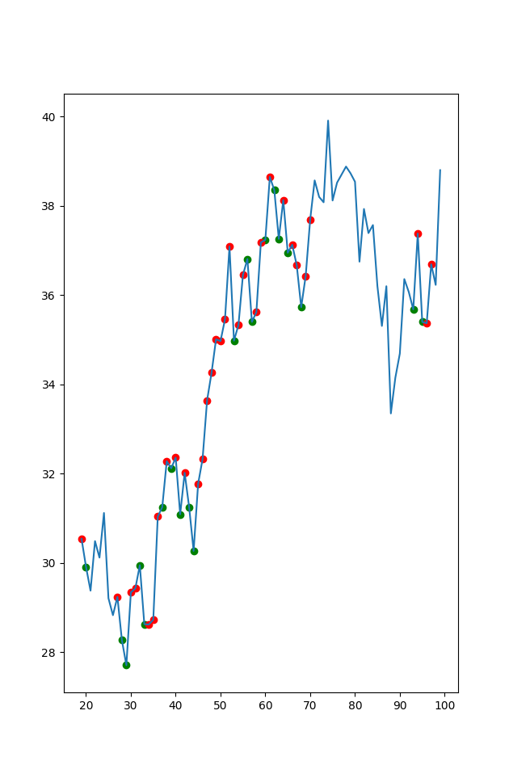

# Pairs Trading

This is the code that goes along with a live stream. More info in `goals.txt`

Live Stream Part 1
----
In P1 I coded the basic strategy and explained how it works. At the end of part one, we have a graph that shows the buy and sell signals based on changes in correlation. 

